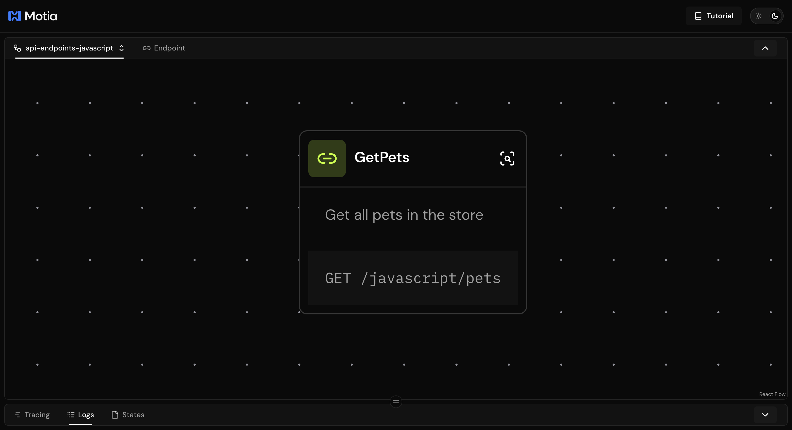
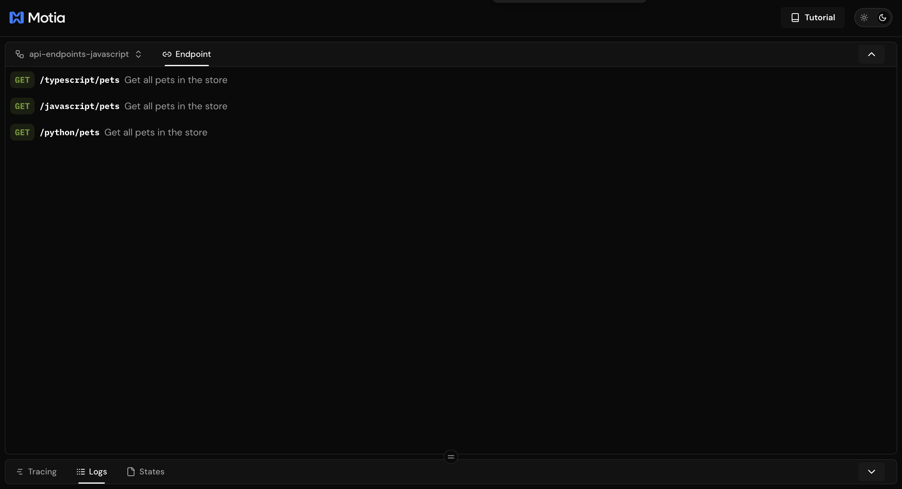
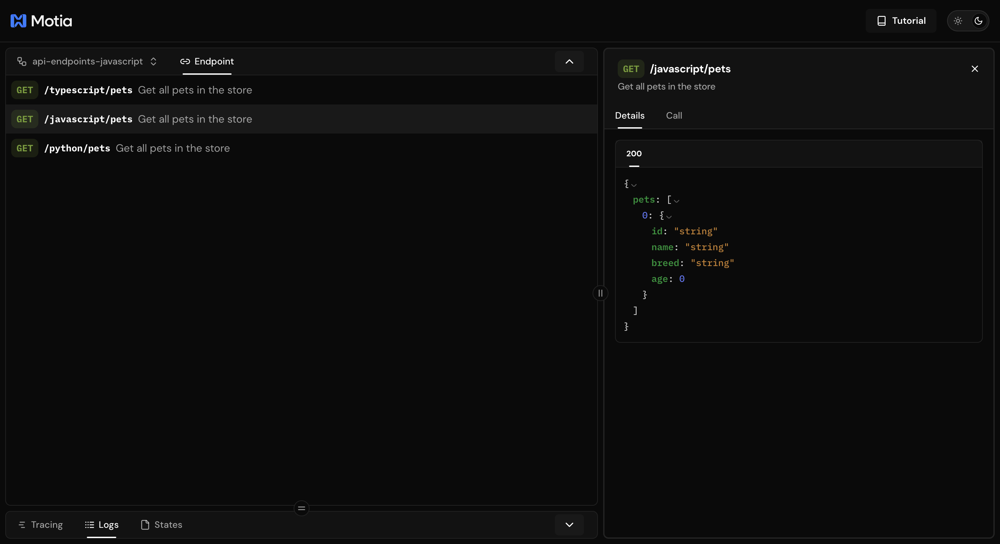
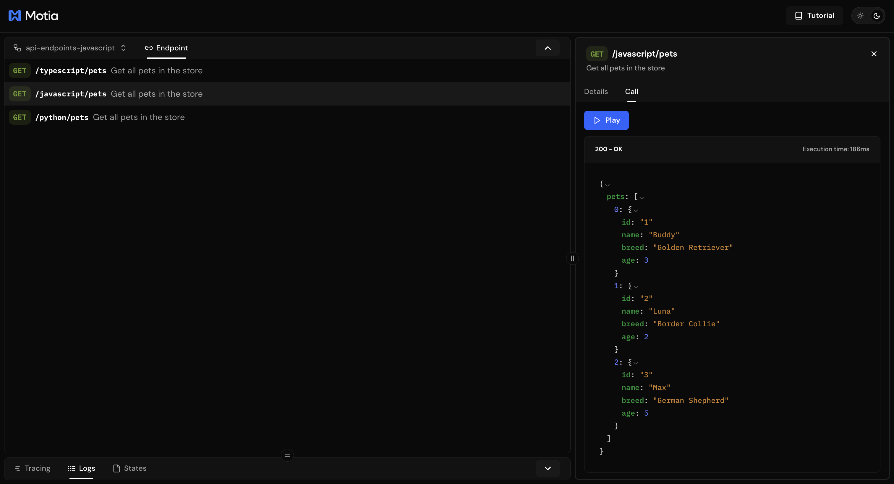

# API Endpoints

In this section, you'll:
- Start with a simple **GET /pets** endpoint.
- Then add more endpoints: **view one pet, create, update, and delete**.
- Learn the **API Step** shape (config + handler) and where files live.
- **Run & test** each endpoint in Workbench and with `curl`.
- **Practice with a quick exercise** to reinforce your learning.

> **Why start with `GET /pets`?**  
> Every app begins with reading data. Listing pets provides a quick and clear way to explain Motia’s API Step without extra concepts like validation.

---

## Before you start
- You’ve completed the **[Quick Start](https://www.motia.dev/docs/getting-started/quick-start)** guide or cloned the **[Starter Template](https://github.com/MotiaDev/build-your-first-app)** from the repository.
- `npx motia dev` is running so the **Workbench** is available at `http://localhost:3000`.

---

## Step 1 — Create the endpoint file

We will place our step inside the `steps` folder. Depending on how you started your project, you have two options:

- **If you cloned the Starter Template** → the `steps` folder already has language-specific subfolders (`typescript`, `javascript`, `python`). Create your new file inside the folder for your language.  
- **If you used the Quick Start guide** → the `steps` folder does not include any language-specific subfolders. Create a subfolder for your language (e.g. `steps/typescript`) and put your file inside it. You can create just one language folder to follow along, or set up for the three languages, if you would like to experiment.

<Tabs items={['TypeScript', 'JavaScript', 'Python']}>
<Tab value="TypeScript">
Create: `steps/typescript/get-pets.step.ts`
</Tab>
<Tab value="JavaScript">  
Create: `steps/javascript/get-pets.step.js`
</Tab>
<Tab value="Python">
Create: `steps/python/get_pets.step.py`
</Tab>
</Tabs>

At this point, you should have a new file named `get-pets.step.ts` (or `.js` / `.py` depending on your language) inside your chosen language folder. In the next step, you will define the `config` and `handler` that make up your first API Step.

## Step 2 — Define the API Step

Now add the code that creates your first API endpoint. Copy this into your file:

<Tabs items={['TS', 'JS', 'Python']}>
  <Tab value="TS">
    ```typescript
import { ApiRouteConfig, Handlers } from "motia";
import { z } from "zod";

export const config: ApiRouteConfig = {
  type: "api",
  name: "GetPets",
  description: "Get all pets in the store",
  method: "GET",
  path: "/typescript/pets",
  responseSchema: {
    200: z.object({
      pets: z.array(
        z.object({
          id: z.string(),
          name: z.string(),
          breed: z.string(),
          age: z.number(),
        })
      ),
    }),
  },
  emits: [],
  flows: ["api-endpoints-typescript"],
};

export const handler: Handlers["GetPets"] = async (req, { logger }) => {
  logger.info("Getting all pets");

  // In a real app, you will query from a database
  const pets = [
    { id: "1", name: "Buddy", breed: "Golden Retriever", age: 3 },
    { id: "2", name: "Luna", breed: "Border Collie", age: 2 },
    { id: "3", name: "Max", breed: "German Shepherd", age: 5 },
  ];

  return {
    status: 200,
    body: { pets },
  };
};

    ```
  </Tab>
  <Tab value="JS">
    ```javascript
    const { z } = require("zod");

const config = {
  type: "api",
  name: "GetPets",
  description: "Get all pets in the store",
  method: "GET",
  path: "/javascript/pets",
  responseSchema: {
    200: z.object({
      pets: z.array(
        z.object({
          id: z.string(),
          name: z.string(),
          breed: z.string(),
          age: z.number(),
        })
      ),
    }),
  },
  emits: [],
  flows: ["api-endpoints-javascript"],
};

const handler = async (req, { logger }) => {
  logger.info("Getting all pets");

  // In a real app, you will query from a database
  const pets = [
    { id: "1", name: "Buddy", breed: "Golden Retriever", age: 3 },
    { id: "2", name: "Luna", breed: "Border Collie", age: 2 },
    { id: "3", name: "Max", breed: "German Shepherd", age: 5 },
  ];

  return {
    status: 200,
    body: { pets },
  };
};

module.exports = { config, handler };
    ```
  </Tab>
  <Tab value="Python">
    ```python
from pydantic import BaseModel
from typing import List


class PetResponse(BaseModel):
    id: str
    name: str
    breed: str
    age: int


config = {
    "type": "api",
    "name": "GetPets",
    "description": "Get all pets in the store",
    "method": "GET",
    "path": "/python/pets",
    "emits": [],
    "responseSchema": {
        "200": {
            "type": "object",
            "properties": {
                "pets": {"type": "array", "items": PetResponse.model_json_schema()}
            },
            "required": ["pets"],
        }
    },
    "flows": ["api-endpoints-python"],
}


async def handler(req, context):
    context.logger.info("Retrieving all pets")

    # In a real app, you'd fetch from a database
    pets = [
        {"id": "1", "name": "Buddy", "breed": "Golden Retriever", "age": 3},
        {"id": "2", "name": "Max", "breed": "German Shepherd", "age": 5},
    ]

    return {"status": 200, "body": {"pets": pets}}

    ```
  </Tab>
</Tabs>

**What this code does**

- **`config`** → This object tells Motia everything about the endpoint:  
  - It’s an **API** step.  
  - It should respond to **GET /pets**.  
  - It describes the shape of the JSON response (an array of pets with `id`, `name`, `breed`, `age`).
  - `emits` allows your step to send events to other parts of your system
  - `flows` organizes related steps together for better visualization in the Workbench
  - We'll use both of these more in the upcoming sections. You can read more about [events](/docs/concepts/cli#emit) and [flows](/docs/concepts/flows-and-visualization) in the documentation.  

- **`handler`** → This function is what actually runs when someone visits **/pets**.  
  - It logs the request.  
  - It builds a mock list of pets (hard-coded here, but in a real app you’d fetch from a database).  
  - It returns the data wrapped in an HTTP **200 OK** response.  

So, when you run this step and hit `/pets`, Motia will:  
1. Match the request to the config.  
2. Call your handler.  
3. Send back the pets list as JSON.  

Save the file. Your development server will automatically detect the new endpoint.  

Open the **Workbench** at [http://localhost:3000](http://localhost:3000). You’ll see the endpoint appear in the flow that matches your language:  

- `api-endpoints-typescript` if you added the TypeScript file  
- `api-endpoints-javascript` if you added the JavaScript file  
- `api-endpoints-python` if you added the Python file  

For example, after saving the JavaScript version, the Workbench will show a **GetPets** step under the `api-endpoints-javascript` flow:  

  

This confirms Motia has picked up your new API step and made it available.  

### Test the endpoint

You can test your new endpoint in two ways:

#### 1. Using the Workbench  
Go to the **Endpoints** tab in the Workbench. You will see your endpoint listed under the flow for your language (e.g. `/typescript/pets`, `/javascript/pets`, or `/python/pets`).  
 

Click on any of the endpoints, this will open the **Details** tab, where you can review the endpoint's description and response schema.  


- The **description** is the text you set in your `config` (`"Get all pets in the store"`).  
- The **response schema** shows the expected shape of the data (an array of pets with `id`, `name`, `breed`, `age`).  
- This helps you confirm that Motia understood your step correctly before you even make a call.  

Next, switch to the **Call** tab, press **Play**, and Motia will call the endpoint for you. The response will appear in the panel on the right.    


What happens behind the scenes?

- The request goes to `GET /pets`.  
- Motia matches it to the `config` you defined.  
- It runs your `handler` function, which logs the request and returns the mock pets list.  
- The response (with status **200 OK**) appears on the right, showing the JSON data you defined.  

This confirms that your first Motia endpoint is live and working!

#### 2. Using curl  
If you prefer the terminal, you can call the endpoint directly with `curl`:  

```bash
curl http://localhost:3000/javascript/pets
```
And you should see the JSON response:

```json
{
  "pets": [
    { "id": "1", "name": "Buddy", "breed": "Golden Retriever", "age": 3 },
    { "id": "2", "name": "Luna", "breed": "Border Collie", "age": 2 },
    { "id": "3", "name": "Max", "breed": "German Shepherd", "age": 5 }
  ]
}
```
That is it — you just created and tested your first REST API endpoint in Motia. 

With just a `config` object and a `handler` function, you exposed `GET /pets` and saw it return real JSON in the Workbench or via `curl`.

This is the foundation you will build on. In the next steps, we will add more endpoints to view a single pet, create new ones, update them, and even delete them.

{/* ## Building a Pet Store REST API

Now that you understand the core parts of an API endpoint, let's build a complete REST API for a pet store.

We'll create a Pet Store API with full CRUD operations:
- `GET /pet` - List all pets
- `POST /pets` - Create a new pet
- `GET /pets/:id` - Get a specific pet by ID
- `PUT /pets/:id` - Update a pet's information
- `DELETE /pets/:id` - Remove a pet

This covers all the essential REST API patterns you'll use in real applications.

## Create Your First API Endpoint

Let's start by creating a simple endpoint to add new pets to our store.

### Creating the Add Pet API

We'll create a `POST /pets` endpoint that accepts pet information and stores it. This endpoint will demonstrate key REST API concepts like request validation and response handling.

Create a new file for your first endpoint:

**File:** `steps/create-pet.step.ts`

<Tabs items={['TS', 'JS', 'Python']}>
  <Tab value="TS">
    ```typescript
    import { ApiRouteConfig, Handlers } from 'motia'
    import { z } from 'zod'

    export const config: ApiRouteConfig = {
      type: 'api',
      name: 'CreatePet',
      description: 'Create a new pet in the store',
      method: 'POST',
      path: '/pets',
      
      bodySchema: z.object({
        name: z.string(),
        breed: z.string(),
        age: z.number(),
      }),

      responseSchema: {
        200: z.object({
          id: z.string(),
          name: z.string(),
          breed: z.string(),
          age: z.number(),
        }),
      },
    }

    export const handler: Handlers['CreatePet'] = async (req, { logger }) => {
      logger.info('Creating new pet', { body: req.body })

      // In a real app, you will save to a database
      const newPet = {
        id: Date.now().toString(),
        ...req.body,
      }

      return {
        status: 200,
        body: newPet,
      }
    }
    ```
  </Tab>
  <Tab value="JS">
    ```javascript
    const { z } = require('zod')

    exports.config = {
      type: 'api',
      name: 'CreatePet',
      description: 'Create a new pet in the store',
      method: 'POST',
      path: '/pets',
      
      bodySchema: z.object({
        name: z.string(),
        breed: z.string(),
        age: z.number(),
      }),

      responseSchema: {
        200: z.object({
          id: z.string(),
          name: z.string(),
          breed: z.string(),
          age: z.number(),
        }),
      },
    }

    exports.handler = async (req, { logger }) => {
      logger.info('Creating new pet', { body: req.body })

      // In a real app, you will save to a database
      const newPet = {
        id: Date.now().toString(),
        ...req.body,
      }

      return {
        status: 200,
        body: newPet,
      }
    }
    ```
  </Tab>
  <Tab value="Python">
    ```python
    from pydantic import BaseModel
    import time

    class PetRequest(BaseModel):
        name: str
        breed: str
        age: int

    class PetResponse(BaseModel):
        id: str
        name: str
        breed: str
        age: int

    config = {
        'type': 'api',
        'name': 'CreatePet',
        'description': 'Create a new pet in the store',
        'method': 'POST',
        'path': '/pets',
        'bodySchema': PetRequest.model_json_schema(),
        'responseSchema': {
            '200': PetResponse.model_json_schema()
        }
    }

    async def handler(req, context):
        context.logger.info('Creating new pet', {'body': req.get('body')})
        
        # In a real app, you will save to a database
        new_pet = {
            'id': str(int(time.time() * 1000)),
            **req.get('body')
        }
        
        return {
            'status': 200,
            'body': new_pet
        }
    ```
  </Tab>
</Tabs>

The most fundamental part of any API endpoint is defining what HTTP method it accepts and where it lives:

```typescript
method: 'POST',
path: '/pets',
```
This configuration tells Motia to create a POST endpoint at /pets. When your development server is running, users can send requests to http://localhost:3000/pets to create new pets. The POST method is the standard HTTP method for creating new resources in REST APIs.


##  Adding More CRUD Operations

Now that we have a working POST endpoint, let's build out the complete REST API with all CRUD operations. We'll add endpoints to retrieve, update, and delete pets.

### Get All Pets - `GET /pets`

Create a new file to list all pets in the store:

**File:** `steps/get-pets.step.ts`

<Tabs items={['TS', 'JS', 'Python']}>
  <Tab value="TS">
    ```typescript
    import { ApiRouteConfig, Handlers } from 'motia'
    import { z } from 'zod'

    export const config: ApiRouteConfig = {
      type: 'api',
      name: 'GetPets',
      description: 'Get all pets in the store',
      method: 'GET',
      path: '/pets',
      
      responseSchema: {
        200: z.array(z.object({
          id: z.string(),
          name: z.string(),
          breed: z.string(),
          age: z.number(),
        })),
      },
    }

    export const handler: Handlers['GetPets'] = async (req, { logger }) => {
      logger.info('Retrieving all pets')

      // In a real app, you'd fetch from a database
      const pets = [
        { id: "1", name: "Buddy", breed: "Golden Retriever", age: 3 },
        { id: "2", name: "Max", breed: "German Shepherd", age: 5 },
      ]

      return {
        status: 200,
        body: pets,
      }
    }
    ```
  </Tab>
  <Tab value="JS">
    ```javascript
    const { z } = require('zod')

    exports.config = {
      type: 'api',
      name: 'GetPets',
      description: 'Get all pets in the store',
      method: 'GET',
      path: '/pets',
      
      responseSchema: {
        200: z.array(z.object({
          id: z.string(),
          name: z.string(),
          breed: z.string(),
          age: z.number(),
        })),
      },
    }

    exports.handler = async (req, { logger }) => {
      logger.info('Retrieving all pets')

      // In a real app, you'd fetch from a database
      const pets = [
        { id: "1", name: "Buddy", breed: "Golden Retriever", age: 3 },
        { id: "2", name: "Max", breed: "German Shepherd", age: 5 },
      ]

      return {
        status: 200,
        body: pets,
      }
    }
    ```
  </Tab>
  <Tab value="Python">
    ```python
    from pydantic import BaseModel
    from typing import List

    class PetResponse(BaseModel):
        id: str
        name: str
        breed: str
        age: int

    config = {
        'type': 'api',
        'name': 'GetPets',
        'description': 'Get all pets in the store',
        'method': 'GET',
        'path': '/pets',
        'responseSchema': {
            '200': {
                'type': 'array',
                'items': PetResponse.model_json_schema()
            }
        }
    }

    async def handler(req, context):
        context.logger.info('Retrieving all pets')
        
        # In a real app, you'd fetch from a database
        pets = [
            {'id': '1', 'name': 'Buddy', 'breed': 'Golden Retriever', 'age': 3},
            {'id': '2', 'name': 'Max', 'breed': 'German Shepherd', 'age': 5},
        ]
        
        return {
            'status': 200,
            'body': pets
        }
    ```
  </Tab>
</Tabs>


### Get Pet by ID - `GET /pets/:id`

Create a new file to retrieve a specific pet:

**File:** `steps/get-pet-by-id.step.ts`

<Tabs items={['TS', 'JS', 'Python']}>
  <Tab value="TS">
    ```typescript
    import { ApiRouteConfig, Handlers } from 'motia'
    import { z } from 'zod'

    export const config: ApiRouteConfig = {
      type: 'api',
      name: 'GetPetById',
      description: 'Get a specific pet by ID',
      method: 'GET',
      path: '/pets/:id',
      
      responseSchema: {
        200: z.object({
          id: z.string(),
          name: z.string(),
          breed: z.string(),
          age: z.number(),
        }),
        404: z.object({
          error: z.string(),
        }),
      },
    }

    export const handler: Handlers['GetPetById'] = async (req, { logger }) => {
      const petId = req.pathParams.id
      logger.info('Retrieving pet by ID', { petId })

      // In a real app, you'd search your database
      const pets = [
        { id: "1", name: "Buddy", breed: "Golden Retriever", age: 3 },
        { id: "2", name: "Max", breed: "German Shepherd", age: 5 },
      ]

      const pet = pets.find(p => p.id === petId)

      if (!pet) {
        return {
          status: 404,
          body: { error: 'Pet not found' },
        }
      }

      return {
        status: 200,
        body: pet,
      }
    }
    ```
  </Tab>
  <Tab value="JS">
    ```javascript
    const { z } = require('zod')

    exports.config = {
      type: 'api',
      name: 'GetPetById',
      description: 'Get a specific pet by ID',
      method: 'GET',
      path: '/pets/:id',
      
      responseSchema: {
        200: z.object({
          id: z.string(),
          name: z.string(),
          breed: z.string(),
          age: z.number(),
        }),
        404: z.object({
          error: z.string(),
        }),
      },
    }

    exports.handler = async (req, { logger }) => {
      const petId = req.pathParams.id
      logger.info('Retrieving pet by ID', { petId })

      // In a real app, you'd search your database
      const pets = [
        { id: "1", name: "Buddy", breed: "Golden Retriever", age: 3 },
        { id: "2", name: "Max", breed: "German Shepherd", age: 5 },
      ]

      const pet = pets.find(p => p.id === petId)

      if (!pet) {
        return {
          status: 404,
          body: { error: 'Pet not found' },
        }
      }

      return {
        status: 200,
        body: pet,
      }
    }
    ```
  </Tab>
  <Tab value="Python">
    ```python
    from pydantic import BaseModel

    class PetResponse(BaseModel):
        id: str
        name: str
        breed: str
        age: int

    class ErrorResponse(BaseModel):
        error: str

    config = {
        'type': 'api',
        'name': 'GetPetById',
        'description': 'Get a specific pet by ID',
        'method': 'GET',
        'path': '/pets/:id',
        'responseSchema': {
            '200': PetResponse.model_json_schema(),
            '404': ErrorResponse.model_json_schema()
        }
    }

    async def handler(req, context):
        pet_id = req.get('pathParams', {}).get('id')
        context.logger.info('Retrieving pet by ID', {'petId': pet_id})
        
        # In a real app, you'd search your database
        pets = [
            {'id': '1', 'name': 'Buddy', 'breed': 'Golden Retriever', 'age': 3},
            {'id': '2', 'name': 'Max', 'breed': 'German Shepherd', 'age': 5},
        ]
        
        pet = next((p for p in pets if p['id'] == pet_id), None)
        
        if not pet:
            return {
                'status': 404,
                'body': {'error': 'Pet not found'}
            }
        
        return {
            'status': 200,
            'body': pet
        }
    ```
  </Tab>
</Tabs>


### Update Pet - `PUT /pets/:id`

Create a new file to update existing pets:

**File:** `steps/update-pet.step.ts`

<Tabs items={['TS', 'JS', 'Python']}>
  <Tab value="TS">
    ```typescript
    import { ApiRouteConfig, Handlers } from 'motia'
    import { z } from 'zod'

    export const config: ApiRouteConfig = {
      type: 'api',
      name: 'UpdatePet',
      description: 'Update a pet by ID',
      method: 'PUT',
      path: '/pets/:id',
      
      bodySchema: z.object({
        name: z.string(),
        breed: z.string(),
        age: z.number(),
      }),

      responseSchema: {
        200: z.object({
          id: z.string(),
          name: z.string(),
          breed: z.string(),
          age: z.number(),
        }),
        404: z.object({
          error: z.string(),
        }),
      },
    }

    export const handler: Handlers['UpdatePet'] = async (req, { logger }) => {
      const petId = req.pathParams.id
      logger.info('Updating pet', { petId, body: req.body })

      // In a real app, you'd update your database
      const pets = [
        { id: "1", name: "Buddy", breed: "Golden Retriever", age: 3 },
        { id: "2", name: "Max", breed: "German Shepherd", age: 5 },
      ]

      const petIndex = pets.findIndex(p => p.id === petId)

      if (petIndex === -1) {
        return {
          status: 404,
          body: { error: 'Pet not found' },
        }
      }

      const updatedPet = {
        id: petId,
        ...req.body,
      }

      return {
        status: 200,
        body: updatedPet,
      }
    }
    ```
  </Tab>
  <Tab value="JS">
    ```javascript
    const { z } = require('zod')

    exports.config = {
      type: 'api',
      name: 'UpdatePet',
      description: 'Update a pet by ID',
      method: 'PUT',
      path: '/pets/:id',
      
      bodySchema: z.object({
        name: z.string(),
        breed: z.string(),
        age: z.number(),
      }),

      responseSchema: {
        200: z.object({
          id: z.string(),
          name: z.string(),
          breed: z.string(),
          age: z.number(),
        }),
        404: z.object({
          error: z.string(),
        }),
      },
    }

    exports.handler = async (req, { logger }) => {
      const petId = req.pathParams.id
      logger.info('Updating pet', { petId, body: req.body })

      // In a real app, you'd update your database
      const pets = [
        { id: "1", name: "Buddy", breed: "Golden Retriever", age: 3 },
        { id: "2", name: "Max", breed: "German Shepherd", age: 5 },
      ]

      const petIndex = pets.findIndex(p => p.id === petId)

      if (petIndex === -1) {
        return {
          status: 404,
          body: { error: 'Pet not found' },
        }
      }

      const updatedPet = {
        id: petId,
        ...req.body,
      }

      return {
        status: 200,
        body: updatedPet,
      }
    }
    ```
  </Tab>
  <Tab value="Python">
    ```python
    from pydantic import BaseModel

    class PetRequest(BaseModel):
        name: str
        breed: str
        age: int

    class PetResponse(BaseModel):
        id: str
        name: str
        breed: str
        age: int

    class ErrorResponse(BaseModel):
        error: str

    config = {
        'type': 'api',
        'name': 'UpdatePet',
        'description': 'Update a pet by ID',
        'method': 'PUT',
        'path': '/pets/:id',
        'bodySchema': PetRequest.model_json_schema(),
        'responseSchema': {
            '200': PetResponse.model_json_schema(),
            '404': ErrorResponse.model_json_schema()
        }
    }

    async def handler(req, context):
        pet_id = req.get('pathParams', {}).get('id')
        context.logger.info('Updating pet', {'petId': pet_id, 'body': req.get('body')})
        
        # In a real app, you'd update your database
        pets = [
            {'id': '1', 'name': 'Buddy', 'breed': 'Golden Retriever', 'age': 3},
            {'id': '2', 'name': 'Max', 'breed': 'German Shepherd', 'age': 5},
        ]
        
        pet_index = next((i for i, p in enumerate(pets) if p['id'] == pet_id), -1)
        
        if pet_index == -1:
            return {
                'status': 404,
                'body': {'error': 'Pet not found'}
            }
        
        updated_pet = {
            'id': pet_id,
            **req.get('body')
        }
        
        return {
            'status': 200,
            'body': updated_pet
        }
    ```
  </Tab>
</Tabs>

### Delete Pet - `DELETE /pets/:id`

Create a new file to remove pets from the store:

**File:** `steps/delete-pet.step.ts`

<Tabs items={['TS', 'JS', 'Python']}>
  <Tab value="TS">
    ```typescript
    import { ApiRouteConfig, Handlers } from 'motia'
    import { z } from 'zod'

    export const config: ApiRouteConfig = {
      type: 'api',
      name: 'DeletePet',
      description: 'Delete a pet by ID',
      method: 'DELETE',
      path: '/pets/:id',
      
      responseSchema: {
        200: z.object({
          message: z.string(),
        }),
        404: z.object({
          error: z.string(),
        }),
      },
    }

    export const handler: Handlers['DeletePet'] = async (req, { logger }) => {
      const petId = req.pathParams.id
      logger.info('Deleting pet', { petId })

      // In a real app, you'd remove from your database
      const pets = [
        { id: "1", name: "Buddy", breed: "Golden Retriever", age: 3 },
        { id: "2", name: "Max", breed: "German Shepherd", age: 5 },
      ]

      const petExists = pets.some(p => p.id === petId)

      if (!petExists) {
        return {
          status: 404,
          body: { error: 'Pet not found' },
        }
      }

      return {
        status: 200,
        body: { message: `Pet with ID ${petId} has been deleted` },
      }
    }
    ```
  </Tab>
  <Tab value="JS">
    ```javascript
    const { z } = require('zod')

    exports.config = {
      type: 'api',
      name: 'DeletePet',
      description: 'Delete a pet by ID',
      method: 'DELETE',
      path: '/pets/:id',
      
      responseSchema: {
        200: z.object({
          message: z.string(),
        }),
        404: z.object({
          error: z.string(),
        }),
      },
    }

    exports.handler = async (req, { logger }) => {
      const petId = req.pathParams.id
      logger.info('Deleting pet', { petId })

      // In a real app, you'd remove from your database
      const pets = [
        { id: "1", name: "Buddy", breed: "Golden Retriever", age: 3 },
        { id: "2", name: "Max", breed: "German Shepherd", age: 5 },
      ]

      const petExists = pets.some(p => p.id === petId)

      if (!petExists) {
        return {
          status: 404,
          body: { error: 'Pet not found' },
        }
      }

      return {
        status: 200,
        body: { message: `Pet with ID ${petId} has been deleted` },
      }
    }
    ```
  </Tab>
  <Tab value="Python">
    ```python
    from pydantic import BaseModel

    class DeleteResponse(BaseModel):
        message: str

    class ErrorResponse(BaseModel):
        error: str

    config = {
        'type': 'api',
        'name': 'DeletePet',
        'description': 'Delete a pet by ID',
        'method': 'DELETE',
        'path': '/pets/:id',
        'responseSchema': {
            '200': DeleteResponse.model_json_schema(),
            '404': ErrorResponse.model_json_schema()
        }
    }

    async def handler(req, context):
        pet_id = req.get('pathParams', {}).get('id')
        context.logger.info('Deleting pet', {'petId': pet_id})
        
        # In a real app, you'd remove from your database
        pets = [
            {'id': '1', 'name': 'Buddy', 'breed': 'Golden Retriever', 'age': 3},
            {'id': '2', 'name': 'Max', 'breed': 'German Shepherd', 'age': 5},
        ]
        
        pet_exists = any(p['id'] == pet_id for p in pets)
        
        if not pet_exists:
            return {
                'status': 404,
                'body': {'error': 'Pet not found'}
            }
        
        return {
            'status': 200,
            'body': {'message': f'Pet with ID {pet_id} has been deleted'}
        }
    ```
  </Tab>
</Tabs>


## Testing the Complete REST API
You now have a full CRUD REST API. Here are all the endpoints you can test:

- `POST /pets` - Create a new pet
- `GET /pets` - List all pets
- `GET /pets/:id` - Get a specific pet
- `PUT /pets/:id` - Update a pet
- `DELETE /pets/:id` - Delete a pet

You can test each endpoint using the Workbench interface or with curl commands. This covers all the essential patterns you'll need for building REST APIs. */}